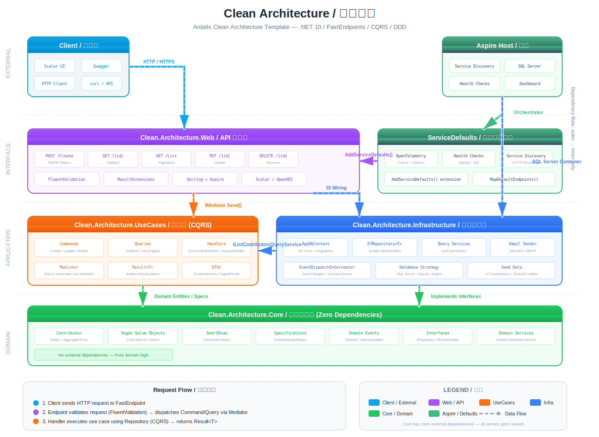

[](https://github.com/ardalis/CleanArchitecture/actions)
[](https://github.com/ardalis/CleanArchitecture/actions/workflows/publish.yml)
[](https://www.nuget.org/packages/Ardalis.CleanArchitecture.Template/)

<a href="https://twitter.com/intent/follow?screen_name=ardalis">
    
</a> &nbsp; <a href="https://twitter.com/intent/follow?screen_name=nimblepros">
    
</a>

<p>


</p>

# Clean Architecture / 整洁架构



A starting point for Clean Architecture with ASP.NET Core. [Clean Architecture](https://8thlight.com/blog/uncle-bob/2012/08/13/the-clean-architecture.html) is just the latest in a series of names for the same loosely-coupled, dependency-inverted architecture. You will also find it named [hexagonal](https://alistair.cockburn.us/hexagonal-architecture), [ports-and-adapters](http://www.dossier-andreas.net/software_architecture/ports_and_adapters.html), or [onion architecture](http://jeffreypalermo.com/blog/the-onion-architecture-part-1/).

Learn more about Clean Architecture and this template in [NimblePros' Introducing Clean Architecture course](https://academy.nimblepros.com/p/learn-clean-architecture). Use code ARDALIS to save 20%.

This architecture is used in the [DDD Fundamentals course](https://www.pluralsight.com/courses/fundamentals-domain-driven-design) by [Steve Smith](https://ardalis.com) and [Julie Lerman](https://thedatafarm.com/).

## Tech Stack / 技术栈

| Technology | Purpose |
|---|---|
| **.NET 10** | Runtime (preview) |
| **FastEndpoints** | REPR pattern API (not Controllers) |
| **Mediator** | CQRS with source generation (not MediatR) |
| **Ardalis.Result** | Operation result pattern |
| **Ardalis.Specification** | Repository + specification pattern |
| **Vogen** | Strongly-typed value objects (IDs, names) |
| **SmartEnum** | Type-safe enumerations |
| **EF Core 10** | ORM with SQL Server / SQLite |
| **Serilog** | Structured logging |
| **.NET Aspire** | Service orchestration & OpenTelemetry |
| **Testcontainers** | Docker-based integration testing |

## Module Architecture / 模块架构

| Project | Layer | Responsibility |
|---|---|---|
| **Clean.Architecture.Core** | Domain | Entities, aggregates, value objects (Vogen), specifications, domain events, interfaces (`IRepository`, `IEmailSender`), domain services |
| **Clean.Architecture.UseCases** | Application | CQRS commands/queries, handlers (`ICommandHandler`/`IQueryHandler`), DTOs, query service interfaces |
| **Clean.Architecture.Infrastructure** | Infrastructure | EF Core `AppDbContext`, `EfRepository<T>`, migrations, query services, email sender, `EventDispatchInterceptor` |
| **Clean.Architecture.Web** | Interface | FastEndpoints (REPR), request/response/validator DTOs, `ResultExtensions`, Serilog + Aspire config |
| **Clean.Architecture.ServiceDefaults** | Cross-cutting | Aspire service defaults (OpenTelemetry, health checks, service discovery, HTTP resilience) |
| **Clean.Architecture.AspireHost** | Orchestration | Aspire host for local development orchestration |

**Dependency rule:** Core <- UseCases <- Infrastructure, Core <- UseCases <- Web. Core has zero external dependencies.

## Data Flow / 数据流程

```
Client → FastEndpoint → FluentValidation → IMediator.Send(Command/Query)
  → Handler (UseCases) → IRepository<T> / IReadRepository<T> (Core interfaces)
    → EfRepository<T> (Infrastructure implementation) → EF Core → Database
  ← Result<T> ← ResultExtensions → Typed HTTP Result (200/201/204/400/404)
```

**CQRS separation:** Commands use `IRepository<T>` for writes. Queries use `IReadRepository<T>` for reads.

## Getting Started / 快速开始

### Prerequisites

- .NET 10 SDK (preview)
- Docker Desktop (optional, for Testcontainers functional tests)

### Build & Run

```bash
# Restore and build
dotnet build Clean.Architecture.slnx

# Run the web app
dotnet run --project src/Clean.Architecture.Web

# Run all tests
dotnet test Clean.Architecture.slnx

# Run a specific test project
dotnet test tests/Clean.Architecture.UnitTests
dotnet test tests/Clean.Architecture.IntegrationTests
dotnet test tests/Clean.Architecture.FunctionalTests
```

### EF Core Migrations

```bash
cd src/Clean.Architecture.Web

dotnet ef migrations add MigrationName \
  -c AppDbContext \
  -p ../Clean.Architecture.Infrastructure/Clean.Architecture.Infrastructure.csproj \
  -s Clean.Architecture.Web.csproj \
  -o Data/Migrations

dotnet ef database update \
  -c AppDbContext \
  -p ../Clean.Architecture.Infrastructure/Clean.Architecture.Infrastructure.csproj \
  -s Clean.Architecture.Web.csproj
```

## API Endpoints / API 端点

All endpoints are under the `Contributors` tag. OpenAPI docs available at `/scalar/v1` when running.

| Method | Route | Description | Success | Error |
|---|---|---|---|---|
| `POST` | `/Contributors` | Create a new contributor | `201 Created` | `400 Validation` |
| `GET` | `/Contributors/{id}` | Get contributor by ID | `200 OK` | `404 Not Found` |
| `GET` | `/Contributors?page=1&per_page=10` | List contributors (paginated) | `200 OK` | `400 Invalid params` |
| `PUT` | `/Contributors/{id}` | Update contributor name | `200 OK` | `404 / 400` |
| `DELETE` | `/Contributors/{id}` | Delete contributor | `204 No Content` | `404 Not Found` |

### Example Requests

**Create a contributor:**
```bash
curl -X POST https://localhost:5001/Contributors \
  -H "Content-Type: application/json" \
  -d '{"name": "John Doe", "phoneNumber": "+1 555-1234567"}'
```

**Get contributor by ID:**
```bash
curl https://localhost:5001/Contributors/1
```

**List with pagination (Link header):**
```bash
curl https://localhost:5001/Contributors?page=2&per_page=10
```

**Update a contributor:**
```bash
curl -X PUT https://localhost:5001/Contributors/1 \
  -H "Content-Type: application/json" \
  -d '{"id": 1, "name": "Jane Doe"}'
```

**Delete a contributor:**
```bash
curl -X DELETE https://localhost:5001/Contributors/1
```

## Database Strategy / 数据库策略

Connection string priority: Aspire `cleanarchitecture` > SQL Server `DefaultConnection` (Windows or `USE_SQL_SERVER=true`) > SQLite `SqliteConnection`.

Dev startup uses `EnsureCreatedAsync` (SQLite) or `MigrateAsync` (SQL Server) + seed data (27 contributors).

## Design Decisions / 设计决策

- **FastEndpoints (REPR)** instead of Controllers — one endpoint class per route
- **Mediator** with source generation instead of MediatR — handlers return `ValueTask`, not `Task`
- **Ardalis.Result** — all handlers return `Result<T>`, mapped to typed HTTP results via `ResultExtensions`
- **Vogen** for strongly-typed IDs (`ContributorId`) and value objects (`ContributorName`) via source generation
- **Domain Events** — dual dispatch: entity-level via `RegisterDomainEvent()` + `EventDispatchInterceptor` (EF interceptor), and explicit `IMediator.Publish()` from domain services
- **Central Package Management** — all versions in `Directory.Packages.props`

## Template Installation / 模板安装

```bash
dotnet new install Ardalis.CleanArchitecture.Template
dotnet new clean-arch -n MyProject
```

See [full documentation](https://ardalis.github.io/CleanArchitecture) for template options and migration guides.

## Courses & Resources

- [Introducing Clean Architecture Course](https://academy.nimblepros.com/p/intro-to-clean-architecture) (NimblePros)
- [DDD Fundamentals](https://www.pluralsight.com/courses/fundamentals-domain-driven-design) (Pluralsight)
- [Live Stream Recordings](https://www.youtube.com/c/Ardalis/search?query=clean%20architecture)
- [DotNetRocks Podcast](https://player.fm/series/net-rocks/clean-architecture-with-steve-smith)

:school: Contact [NimblePros](https://nimblepros.com/) for Clean Architecture or DDD training for your team.

## Give a Star!

If you like or are using this project to learn or start your solution, please give it a star. Thanks!

Or if you're feeling really generous, we now support GitHub sponsorships - see the button above.
